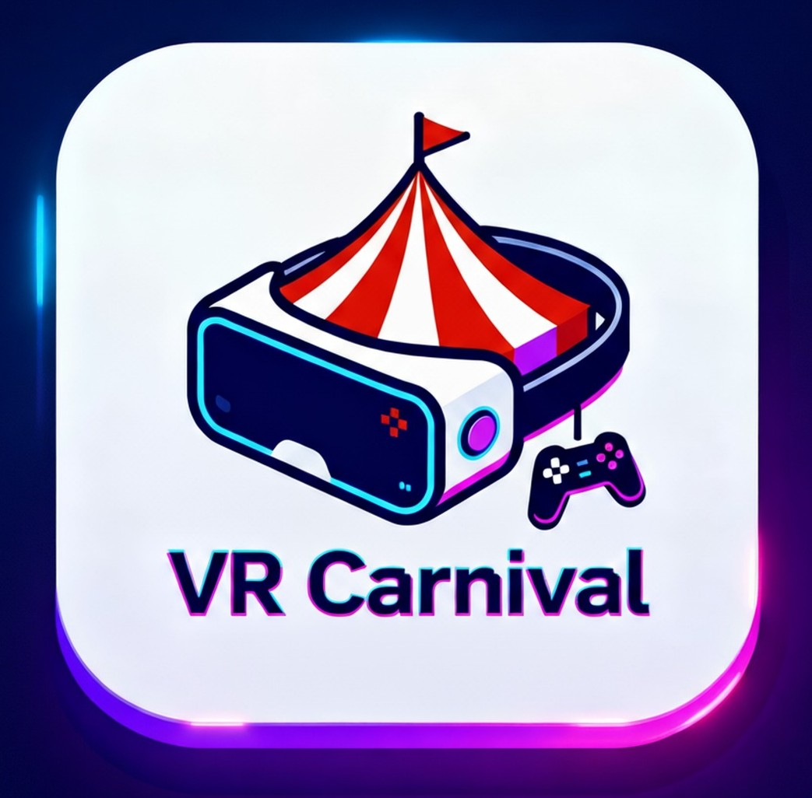

# VR Carnival: The Web3 Metaverse of Mini Games

Welcome to **VR Carnival**, an immersive metaverse experience where players enjoy classic carnival games and fun activities—like Ferris Wheel rides, horse ring-arounds, and more—inside a vibrant virtual world. Powered by cutting-edge Web3 technology, VR Carnival redefines gaming with seamless onboarding, gasless transactions, and true digital ownership.
<!-- Badges / Labels -->

## Key Features

- **Metaverse Carnival**: Explore a virtual fairground packed with mini games and interactive attractions.
- **Gasless Gaming**: Players receive embedded wallets upon onboarding. All transaction fees are sponsored, ensuring a frictionless, uninterrupted experience.
- **Web3 Integration**: Smart contracts on Ethereum manage game logic, assets, and rewards.
- **Decentralized Storage**: Game assets and NFTs are stored securely on Filecoin, guaranteeing permanence and transparency.
- **On-Chain Randomness**: Pyth Network’s random number generator powers games like “Color Guess,” ensuring provable fairness.
- **NFT Ecosystem**: ERC-721 collection for unique items and ERC-1155 for in-game assets. Players can buy, win, or mint NFTs by completing challenges.
- **DePIN Infrastructure**: Game APIs are hosted on Fluence, leveraging decentralized compute for reliability and censorship resistance.
- **VR Technology**: Built with Unity, Meta XR, and Oculus for a fully immersive, cross-platform experience.

## Gameplay Highlights

- **Mini Games**: Enjoy a variety of classic and innovative carnival games.
- **NFT Rewards**: Win or purchase NFTs representing game assets, collectibles, and achievements.
- **Color Guess Game**: Experience true randomness and fairness with Pyth Network’s entropy-powered RNG.

## Tech Stack

- **Unity, Meta XR, Oculus**: VR game development and deployment.
- **Ethereum & Solidity**: Smart contracts for game logic, asset management, and rewards.
- **Fluence**: Decentralized hosting of game APIs (DePIN).
- **Filecoin**: Decentralized storage for NFTs and game assets.
- **Pyth Network**: On-chain randomness for game mechanics.
- **Embedded Wallets**: Seamless onboarding and gasless transactions for all players.

## How It Works

1. **Onboard**: Players join the carnival and receive an embedded wallet.
2. **Play**: Enjoy games and activities without worrying about gas fees—transactions are sponsored by the platform.
3. **Own**: Win, buy, or mint NFTs representing assets and achievements.
4. **Store**: All digital assets are stored on Filecoin for security and transparency.
5. **Fairness**: Game outcomes are powered by on-chain randomness from Pyth Network.

## ETH Global Hackathon 🏆

This project was built for the prestigious ETH Global hackathon, showcasing the future of gaming, ownership, and decentralized infrastructure.

## Team

- Anjana Modugu | `Unity/VR Developer`
- Daksh Kalkarni | `Unity / VR Developer`
- Nithish Sriram | `Backend Developer`
- Dave Meshak J | `Blockchain Developer`

## License

This project is licensed under the MIT License. See the [LICENSE](./LICENSE) file for details.

